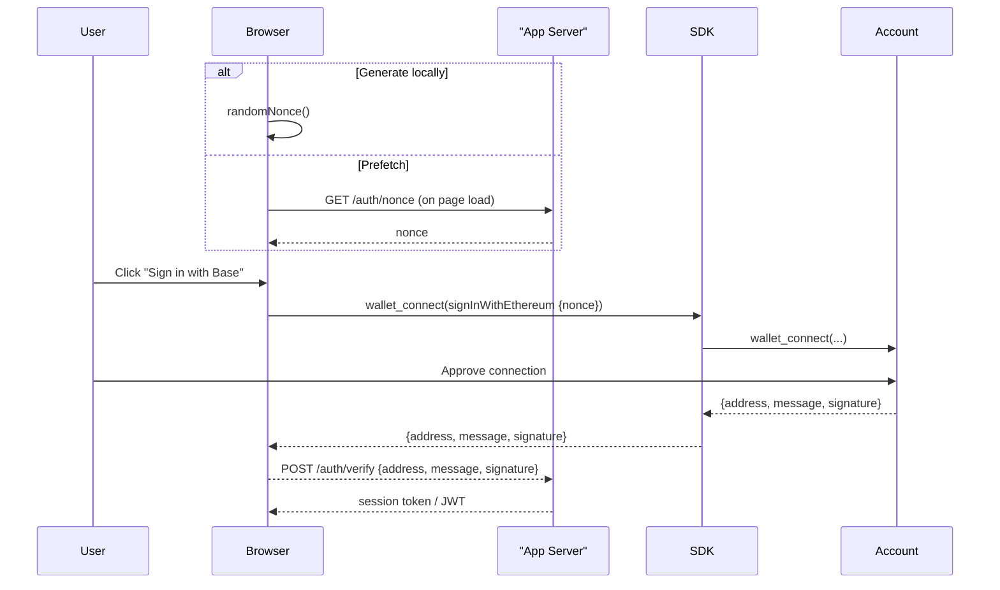

import {BasePayButton} from "/snippets/BasePayButton.mdx"
import {SignInWithBaseButton} from "/snippets/SignInWithBaseButton.mdx"

## Why wallet signatures instead of passwords?

1. **No new passwords** – authentication happens with the key the user already controls.  
2. **Nothing to steal or reuse** – each login is a one-off, domain-bound signature that never leaves the user’s device.  
3. **Wallet-agnostic** – works in any EIP-1193 wallet (browser extension, mobile deep-link, embedded provider) and follows the open ["Sign in with Ethereum" (SIWE) EIP-4361](https://eips.ethereum.org/EIPS/eip-4361) standard.

Base Accounts build on those standards so you can reuse any SIWE tooling – while still benefiting from passkeys, session keys, and smart-wallet security.

<Warning>
**Please Follow the Brand Guidelines** 

If you intend on using the `SignInWithBaseButton`, please follow the [Brand Guidelines](/base-account/reference/ui-elements/brand-guidelines) to ensure consistency across your application.

</Warning>

## High-level flow



<Note type="info">
**Undeployed Smart Wallets?**  <br/> Base Account signatures include the <a href="https://eips.ethereum.org/EIPS/eip-6492" target="_blank">ERC-6492</a> wrapper so they can be verified even before the wallet contract is deployed.  Viem’s `verifyMessage` and `verifyTypedData` handle this automatically.
</Note>

## Implementation 

### Code Snippets

<CodeGroup>
```ts Browser (SDK)
import { createBaseAccountSDK } from "@base-org/account";
import crypto from 'crypto';

// Initialize the SDK (no config needed for defaults)
const provider = createBaseAccountSDK().getProvider();

// 1 — get a fresh nonce (generate locally or prefetch from backend)
const nonce = window.crypto.randomUUID().replace(/-/g, '');
// OR prefetch from server
// const nonce = await fetch('/auth/nonce').then(r => r.text());

// 2 — switch to Base Chain
const switchChainResponse = await provider.request({
        method: "wallet_switchEthereumChain",
        params: [{ chainId: '0x2105' }],
      })

      console.log('Switch chain response:', switchChainResponse);

// 3 — connect and authenticate
try {
  const { accounts } = await provider.request({
    method: 'wallet_connect',
    params: [{
      version: '1',
      capabilities: {
        signInWithEthereum: { 
          nonce, 
          chainId: '0x2105' // Base Mainnet - 8453
        }
      }
    }]
  });
  const { address } = accounts[0];
  const { message, signature } = accounts[0].capabilities.signInWithEthereum;
  await fetch('/auth/verify', {
    method: 'POST',
    headers: { 'Content-Type': 'application/json' },
    body: JSON.stringify({ address, message, signature })
  });
} catch (err) {
  console.error(`err ${err}`);
}
```
```ts Backend (Viem)
import { createPublicClient, http } from 'viem';
import { base } from 'viem/chains';

const client = createPublicClient({ chain: base, transport: http() });

export async function verifySig(req, res) {
  const { address, message, signature } = req.body;
  const valid = await client.verifyMessage({ address, message, signature });
  if (!valid) return res.status(401).json({ error: 'Invalid signature' });
  // create session / JWT
  res.json({ ok: true });
}
```
</CodeGroup>

<Note type="tip">
If using the above code beyond Base Account, note that not every wallet supports the new [<code>wallet_connect</code> method](/base-account/reference/core/provider-rpc-methods/wallet_connect) yet.  If the call throws [<code>method_not_supported</code>], fall back to using <code>eth_requestAccounts</code> and <code>personal_sign</code>.
</Note>

<Note type="tip">
To avoid [popup blockers](/base-account/more/troubleshooting/usage-details/popups#default-blocking-behavior), fetch or generate the nonce <strong>before</strong> the user presses "Sign in with Base" (for example on page load). For security, the only requirement is that your backend keeps track of every nonce and refuses any that are reused – regardless of where it originated.
</Note>

{/* 
TODO: Link Wagmi Sign in with Base guide
<Note>
For a full React example see the <a href="/docs/base-account/framework-integrations/react-wagmi">React + Wagmi guide</a>.
</Note> */}

### Example Express Server

```ts title="server/auth.ts"
import crypto from 'crypto';
import express from 'express';
import { createPublicClient, http } from 'viem';
import { base } from 'viem/chains';

const app = express();
app.use(express.json());

// Simple in-memory nonce store (swap for Redis or DB in production)
const nonces = new Set<string>();

app.get('/auth/nonce', (_, res) => {
  const nonce = crypto.randomBytes(16).toString('hex');
  nonces.add(nonce);
  res.send(nonce);
});

const client = createPublicClient({ chain: base, transport: http() });

app.post('/auth/verify', async (req, res) => {
  const { address, message, signature } = req.body;

  // 1. Check nonce hasn\'t been reused
  const nonce = message.match(/at (\w{32})$/)?.[1];
  if (!nonce || !nonces.delete(nonce)) {
    return res.status(400).json({ error: 'Invalid or reused nonce' });
  }

  // 2. Verify signature
  const valid = await client.verifyMessage({ address, message, signature });
  if (!valid) return res.status(401).json({ error: 'Invalid signature' });

  // 3. Create session / JWT here
  res.json({ ok: true });
});

app.listen(3001, () => console.log('Auth server listening on :3001'));
```

## Add the Base Sign In With Base Button

Use the pre-built component for a native look-and-feel:

```tsx title="App.tsx"
import { SignInWithBaseButton } from '@base-org/account-ui/react';

export function App() {
  return (
    <SignInWithBaseButton
      colorScheme="light"
      onClick={() => signInWithBase()}
    />
  );
}
```

See full props and theming options in the [Button Reference](/base-account/reference/ui-elements/sign-in-with-base-button) and [Brand Guidelines](/base-account/reference/ui-elements/brand-guidelines).

<Warning>
**Please Follow the Brand Guidelines** 

If you intend on using the `SignInWithBaseButton`, please follow the [Brand Guidelines](/base-account/reference/ui-elements/brand-guidelines) to ensure consistency across your application.

</Warning>
