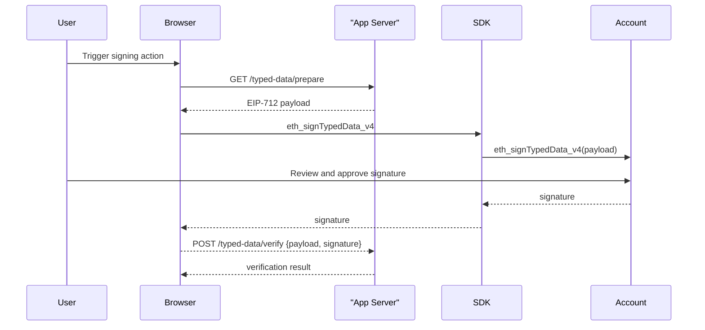

## Overview

Base Account uses [Smart Wallet contracts](https://github.com/coinbase/smart-wallet) under the hood. Smart contract wallets introduce a few differences in how messages are signed compared to traditional Externally Owned Accounts (EOAs). This guide explains how to properly implement message signing using Base Account, covering both standard messages and typed data signatures, as well as some edge cases.

## Introduction

Before walking through the details of how to sign and verify messages using Base Account, it's important to understand some of the use cases of signing messages with wallets, as well as the key differences between EOAs and smart contracts when it comes to signing messages.

### Use Cases for Wallet Signatures

Blockchain-based apps use wallet signatures for two main categories:

1. **Signatures for offchain verification**: Used for authenticating users in onchain apps (e.g., Sign-In with Ethereum) to avoid spoofing. The signature is not used for any onchain action.

2. **Signatures for onchain verification**: Used for signing onchain permissions (e.g., [Permit2](https://github.com/Uniswap/permit2)) or batching transactions. The signature is usually stored for future transactions.

### Smart Contract Wallet Differences

Smart contract wallets handle signatures differently from EOAs in several ways:

- The contract itself doesn't produce signatures - instead, the owner (e.g., passkey) signs messages
- Verification happens through the `isValidSignature` function defined in [EIP-1271](https://eips.ethereum.org/EIPS/eip-1271)
- Smart contract wallet addresses are often deterministic, allowing signature support before deployment via [ERC-6492](https://eips.ethereum.org/EIPS/eip-6492)

## High-level flow

In this guide, we'll walk through the high-level flow of signing and verifying messages using Base Account.



## Implementation

For the purposes of this guide, we'll use a simple example of a typed data payload that contains a permission
to spend user's funds (see [Spend Permissions](/base-account/improve-ux/spend-permissions))

### Code Snippets

<CodeGroup>
```ts Browser (SDK)
import { createBaseAccountSDK } from "@base-org/account";

// Initialize the SDK
const provider = createBaseAccountSDK().getProvider();

// 1 — Prepare the typed data payload
const typedData = {
  domain: {
    name: 'Spend Permission Manager',
    version: '1',
    chainId: 8453, // or any other supported chain
    verifyingContract: SPEND_PERMISSION_MANAGER_ADDRESS,
  },
  types: {
    SpendPermission: [
      { name: 'account', type: 'address' },
      { name: 'spender', type: 'address' },
      { name: 'token', type: 'address' },
      { name: 'allowance', type: 'uint160' },
      { name: 'period', type: 'uint48' },
      { name: 'start', type: 'uint48' },
      { name: 'end', type: 'uint48' },
      { name: 'salt', type: 'uint256' },
      { name: 'extraData', type: 'bytes' },
    ],
  },
  primaryType: 'SpendPermission',
  message: spendPermissionData,
};

// 2 — Request signature from user
try {
  const accounts = await provider.request({
    method: 'eth_requestAccounts'
  });
  
  const signature = await provider.request({
    method: 'eth_signTypedData_v4',
    params: [accounts[0], JSON.stringify(typedData)]
  });

  // 3 — Send to backend for verification
  const response = await fetch('/typed-data/verify', {
    method: 'POST',
    headers: { 'Content-Type': 'application/json' },
    body: JSON.stringify({ 
      typedData, 
      signature, 
      address: accounts[0] 
    })
  });
  
  const result = await response.json();
  console.log('Verification result:', result);
} catch (err) {
  console.error('Signing failed:', err);
}
```

```ts Backend (Viem)
import { createPublicClient, http } from 'viem';
import { base } from 'viem/chains';

const client = createPublicClient({ 
  chain: base, 
  transport: http() 
});

export async function verifyTypedData(req, res) {
  const { typedData, signature, address } = req.body;
  
  try {
    // Verify the typed data signature
    const valid = await client.verifyTypedData({
      address,
      domain: typedData.domain,
      types: typedData.types,
      primaryType: typedData.primaryType,
      message: typedData.message,
      signature
    });

    if (!valid) {
      return res.status(401).json({ error: 'Invalid signature' });
    }

    // Additional validation logic here
    // e.g., check expiry, nonce, permissions, etc.
    const now = Math.floor(Date.now() / 1000);
    if (typedData.message.expiry < now) {
      return res.status(401).json({ error: 'Signature expired' });
    }

    // Process the verified typed data
    res.json({ 
      valid: true, 
      message: 'Signature verified successfully',
      data: typedData.message 
    });
  } catch (error) {
    console.error('Verification error:', error);
    res.status(500).json({ error: 'Verification failed' });
  }
}
```
</CodeGroup>

## Example Express Server

```ts title="server/typed-data.ts"
import express from 'express';
import { createPublicClient, http } from 'viem';
import { base } from 'viem/chains';

const app = express();
app.use(express.json());

const client = createPublicClient({ 
  chain: base, 
  transport: http() 
});

// Simple nonce store (use Redis/DB in production)
const usedNonces = new Set<string>();

app.get('/typed-data/prepare', (req, res) => {
  const { userAddress, action, resource } = req.query;
  
  const nonce = Math.floor(Math.random() * 1000000);
  const expiry = Math.floor(Date.now() / 1000) + 3600; // 1 hour
  
  const typedData = {
    // YOUR TYPED DATA HERE
  }
  
  res.json(typedData);
});

app.post('/typed-data/verify', async (req, res) => {
  const { typedData, signature, address } = req.body;
  
  try {
    // 1. Check nonce hasn't been reused
    const nonceKey = `${address}-${typedData.message.nonce}`;
    if (usedNonces.has(nonceKey)) {
      return res.status(400).json({ error: 'Nonce already used' });
    }
    
    // 2. Check expiry
    const now = Math.floor(Date.now() / 1000);
    if (typedData.message.expiry < now) {
      return res.status(400).json({ error: 'Signature expired' });
    }
    
    // 3. Verify signature
    const valid = await client.verifyTypedData({
      address,
      domain: typedData.domain,
      types: typedData.types,
      primaryType: typedData.primaryType,
      message: typedData.message,
      signature
    });
    
    if (!valid) {
      return res.status(401).json({ error: 'Invalid signature' });
    }
    
    // 4. Mark nonce as used
    usedNonces.add(nonceKey);
    
    // 5. Process the verified action
    res.json({ 
      valid: true,
      message: 'Typed data verified successfully',
      action: typedData.message.action,
      resource: typedData.message.resource
    });
  } catch (error) {
    console.error('Verification error:', error);
    res.status(500).json({ error: 'Verification failed' });
  }
});

app.listen(3001, () => console.log('Typed data server listening on :3001'));
```

## Best Practices

### Domain Separation
Always use unique domain parameters to prevent signature replay across different applications:

```tsx
const domain = {
  name: 'Your App Name',           // Unique app identifier
  version: '1',                    // Version your types
  chainId: 8453,                   // Network-specific
  verifyingContract: contractAddr   // Contract that will verify
};
```

### Nonce Management
Include nonces to prevent replay attacks:

```tsx
// Generate unique nonces
const nonce = crypto.randomBytes(16).toString('hex');

// Store and validate nonces server-side
const usedNonces = new Set(); // Use Redis/DB in production
```

### Expiry Times
Always include expiry timestamps for time-bound signatures:

```tsx
const expiry = Math.floor(Date.now() / 1000) + 3600; // 1 hour
```
