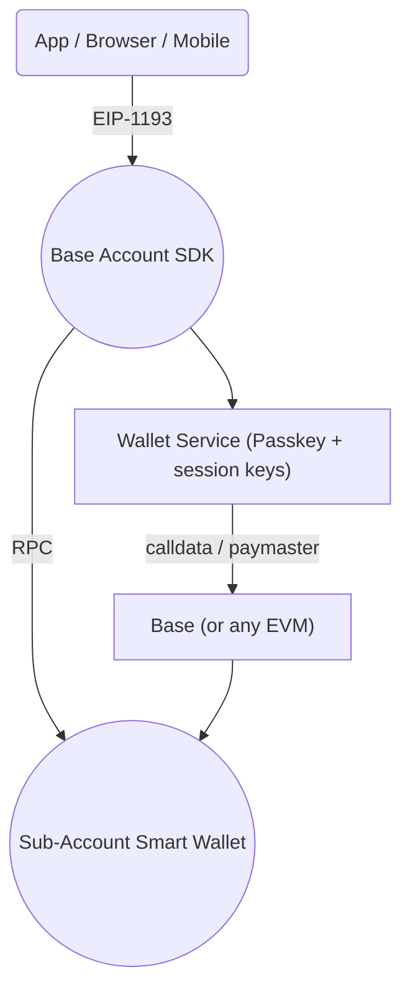

!!! WIP - AI slop currently 

> This page gives you a mental model of how Base Accounts and the SDK fit together. If you only want to ship a feature, jump straight to the Quick-start and Guides—come back here when you need to answer *how* it works.

## High-level diagram

* **SDK** – lightweight TypeScript wrapper that talks EIP-1193 to a wallet and REST/RPC to helper services.
* **Wallet Service** – hosts passkey authentication, key management, paymaster, and profile vault APIs.
* **Smart Wallet contracts** – ERC-4337 account contracts on each supported chain (nine mainnets today).
* **Sub-Accounts** – optional child wallets for gas-free in-app actions.

## Request flows

### Sign in with Base
1. Your app calls `sdk.getProvider().request({ method: "eth_requestAccounts" })`.
2. SDK opens a pop-up (or redirects mobile) to the Wallet Service.
3. User approves with a passkey; service returns an encrypted session key.
4. Provider resolves with `[userAddress]` and emits `"connect"`.

### Base Pay (`pay()` helper)
1. SDK translates `amount` + `recipient` into a `wallet_sendCalls` payload.
2. SDK submits the userOp for user approval to the Wallet Service. 
2. the Wallet Service signs and sponsors gas for the transaction.
3. Transaction is submitted to the Base blockchain; SDK returns `{ id }`.
4. Your app polls `getPaymentStatus({id})`.

### Sub-Account creation
* `wallet_addSubAccount` RPC deploys a deterministic child wallet and emits its address.

## Multi-chain support

The same Base Account address can exist on multiple EVM networks. The SDK selects the chain based on:

1. Parameter overrides (`testnet: true` or `chainId` in advanced calls).
2. The wallet’s currently connected chain.
3. Fallback to Base Mainnet.

## Security model (at a glance)

* **Keys** – Passkeys live in the user’s device; session keys are short-lived and rotated automatically.
* **Contract signatures** – ERC-4337 `validateUserOp` enforces owner key checks on-chain.
* **Paymaster** – Limits sponsored gas, risk-scoped by user op call-data.
* **Browser safety** – SDK enforces COOP/COEP headers and iframe isolation.

For a deeper dive, see the [Reference → Provider RPC Methods](/docs/base-account/reference/core/provider-rpc-methods/request-overview). 