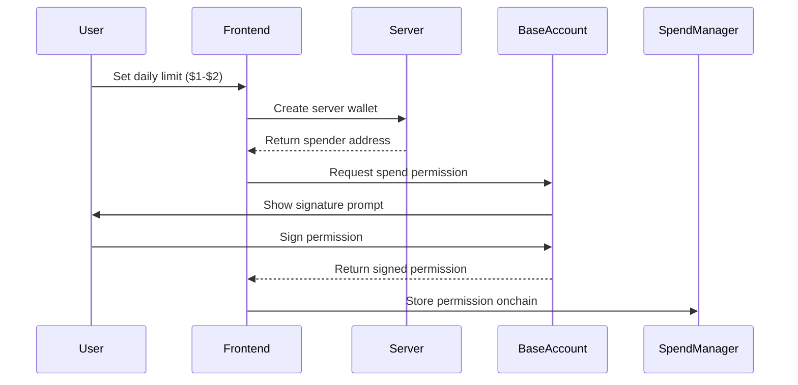
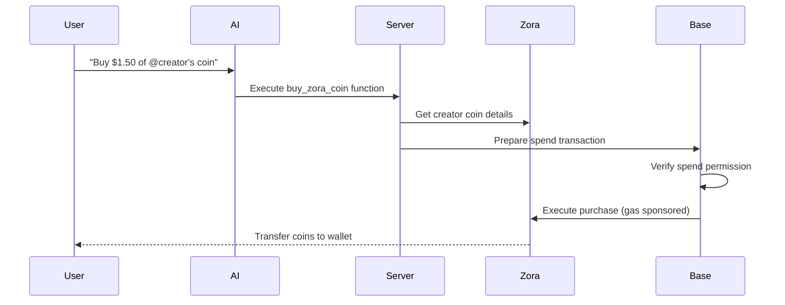

Learn how to build an AI agent that can autonomously purchase [Zora Creator Coins](https://docs.zora.co/coins) using secure [Spend Permissions](/base-account/guides/spend-permissions) on Base.
This example demonstrates how to combine Base Account's [Spend Permissions](/base-account/guides/spend-permissions) with Coinbase Developer Platform (CDP) [Server Wallets](https://docs.cdp.coinbase.com/server-wallets/v2/introduction/quickstart) and [Trade API](https://docs.cdp.coinbase.com/trade-api/quickstart) for seamless, gas-free AI agent transactions.

<Frame>
  
</Frame>

## Overview

This example showcases a complete AI agent implementation that:

- **Authenticates users** with Base Account using [Sign-In with Base (SIWE)](/base-account/guides/authenticate-users)
- **Manages Spend Permissions** allowing users to set daily spending limits using [ Base Account Spend Permissions](/base-account/guides/spend-permissions)
- **Processes natural language** requests to buy Zora creator coins using [OpenAI](https://openai.com/)
- **Executes transactions** autonomously using CDP [Server Wallets](https://docs.cdp.coinbase.com/server-wallets/v2/introduction/quickstart) and [Trade API](https://docs.cdp.coinbase.com/trade-api/quickstart)
- **Sponsors gas fees** using [CDP Paymaster](https://docs.cdp.coinbase.com/paymaster/introduction/welcome) for seamless UX
- **Fetches creator coin details** using [Zora SDK](https://docs.zora.co/coins/sdk)

<CardGroup cols={2}>
  <Card
    title="Live Demo"
    icon="rocket"
    href="https://base-agent-spend-permissions.vercel.app"
  >
    Try the live application and see spend permissions in action
  </Card>
  <Card
    title="Source Code"
    icon="github"
    href="https://github.com/base/demos/tree/master/base-account/agent-spend-permissions"
  >
    Explore the complete implementation on GitHub
  </Card>
</CardGroup>

<Warning>
  **Production Security**: This example uses simplified session management for demonstration. In production, implement proper JWT tokens with secure session secrets.
</Warning>

## Key Features

### 🔐 Secure Authentication

The authentication flow combines frontend wallet connection with backend signature verification:

<CodeGroup>
```typescript src/components/SignInWithBase.tsx
// Frontend: Sign-In with Ethereum implementation
const provider = createBaseAccountSDK({
  appName: "Zora Creator Coins Agent",
}).getProvider();

// 1. Get nonce from server
const nonceResponse = await fetch('/api/auth/verify', { method: 'GET' });
const { nonce } = await nonceResponse.json();

// 2. Connect with SIWE capability
const connectResponse = await provider.request({
  method: "wallet_connect",
  params: [{
    version: "1",
    capabilities: {
      signInWithEthereum: {
        chainId: '0x2105',
        nonce,
      },
    },
  }],
});

// 3. Verify signature on server
const verifyResponse = await fetch('/api/auth/verify', {
  method: 'POST',
  headers: { 'Content-Type': 'application/json' },
  body: JSON.stringify({ address, message, signature })
});
```

```typescript src/app/api/auth/verify/route.ts
// Backend: Signature verification and session management
export async function POST(request: NextRequest) {
  const { address, message, signature } = await request.json();

  // Extract and validate nonce
  const nonce = message.match(/Nonce: (\w+)/)?.[1];
  if (!nonce || !nonces.has(nonce)) {
    return NextResponse.json({ error: 'Invalid or expired nonce' }, { status: 401 });
  }

  // Remove nonce to prevent reuse
  nonces.delete(nonce);

  // Verify signature using viem
  const isValid = await client.verifyMessage({ 
    address: address as `0x${string}`, 
    message, 
    signature: signature as `0x${string}` 
  });
  
  if (isValid) {
    // Create secure session token
    const sessionToken = Buffer.from(`${address}:${Date.now()}`).toString('base64');
    
    const response = NextResponse.json({ ok: true, address, sessionToken });
    
    // Set secure session cookie
    response.cookies.set('session', sessionToken, {
      httpOnly: true,
      secure: process.env.NODE_ENV === 'production',
      sameSite: 'strict',
      maxAge: 60 * 60 * 24 * 7 // 1 week
    });
    
    return response;
  }
}

export async function GET() {
  // Generate secure nonce for authentication challenge
  const array = new Uint8Array(16);
  crypto.getRandomValues(array);
  const nonce = Array.from(array, byte => byte.toString(16).padStart(2, '0')).join('');
  
  nonces.add(nonce);
  return NextResponse.json({ nonce });
}
```
</CodeGroup>

### 💸 Spend Permission Management

Users can grant limited spending authority to the agent:

<CodeGroup>
```typescript src/components/SpendPermissionSetup.tsx
// Frontend: Request spend permission from user
import { requestSpendPermission } from "@base-org/account/spend-permission";
import { createBaseAccountSDK } from "@base-org/account";

const handleSetupPermission = async () => {
  // Get server wallet address
  const walletResponse = await fetch("/api/wallet/create", { method: "POST" });
  const { smartAccountAddress } = await walletResponse.json();

  // Request spend permission
  const permission = await requestSpendPermission({
    account: userAddress as `0x${string}`,
    spender: smartAccountAddress as `0x${string}`,
    token: USDC_BASE_ADDRESS as `0x${string}`,
    chainId: 8453,
    allowance: BigInt(dailyLimit * 1_000_000), // Convert USD to USDC (6 decimals)
    periodInDays: 1,
    provider: createBaseAccountSDK({
      appName: "Zora Creator Coins Agent",
    }).getProvider(),
  });

  // Store permission for later use
  localStorage.setItem("spendPermission", JSON.stringify(permission));
};
```

```typescript src/lib/spend-permissions.ts
// Utility: Spend permission constants and helpers
export const USDC_BASE_ADDRESS = '0x833589fcd6edb6e08f4c7c32d4f71b54bda02913';

export async function getUserSpendPermissions(
  userAccount: string,
  spenderAccount: string
) {
  const permissions = await fetchPermissions({
    account: userAccount as `0x${string}`,
    chainId: 8453,
    spender: spenderAccount as `0x${string}`,
    provider: createBaseAccountSDK({
      appName: "Zora Creator Coins Agent",
    }).getProvider(),
  });

  // Filter for USDC permissions with case-insensitive comparison
  return permissions.filter(p => 
    p.permission?.token?.toLowerCase() === USDC_BASE_ADDRESS.toLowerCase()
  );
}
```
</CodeGroup>

<Callout type="info">
  Spend permissions are granted for USDC on Base mainnet with daily limits between $1-$2, making it safe for testing and demonstrations.
</Callout>

### 🤖 AI Agent Integration

The agent processes natural language requests and executes transactions:

<CodeGroup>
```typescript src/lib/openai.ts
// AI function definition for creator coin purchases
export const ZORA_BUY_FUNCTION = {
  type: 'function' as const,
  function: {
    name: 'buy_zora_coin',
    description: 'Buy a Zora creator coin for a specific user handle and amount',
    parameters: {
      type: 'object',
      properties: {
        zoraHandle: {
          type: 'string',
          description: 'The Zora user handle or identifier to buy coins for',
        },
        amountUSD: {
          type: 'number',
          description: 'The amount in USD to spend on the creator coin',
        },
      },
      required: ['zoraHandle', 'amountUSD'],
    },
  },
};

export async function generateChatResponse(
  messages: ChatMessage[],
  tools: any[] = [ZORA_BUY_FUNCTION]
) {
  const response = await openai.chat.completions.create({
    model: 'gpt-4',
    messages: [
      { role: 'system', content: SYSTEM_PROMPT },
      ...messages,
    ],
    tools,
    tool_choice: 'auto',
    max_completion_tokens: 1000,
  });

  return response;
}
```

```typescript src/components/ChatInterface.tsx
// Frontend: Chat interface with AI agent
const sendMessage = async () => {
  const userMessage: Message = {
    id: Date.now().toString(),
    content: inputValue,
    sender: 'user',
    timestamp: new Date(),
  };

  setMessages(prev => [...prev, userMessage]);
  setInputValue('');
  setIsLoading(true);

  try {
    const response = await fetch('/api/chat', {
      method: 'POST',
      headers: { 'Content-Type': 'application/json' },
      body: JSON.stringify({
        messages: [...messages, userMessage].map(m => ({
          role: m.sender === 'user' ? 'user' : 'assistant',
          content: m.content,
        })),
        userAddress,
      }),
    });

    const data = await response.json();
    
    const agentMessage: Message = {
      id: (Date.now() + 1).toString(),
      content: data.message,
      sender: 'agent',
      timestamp: new Date(),
      toolCall: data.toolCall,
      details: data.details,
    };

    setMessages(prev => [...prev, agentMessage]);
  } catch (error) {
    console.error('Chat error:', error);
  } finally {
    setIsLoading(false);
  }
};
```
</CodeGroup>

### ⛽ Gas-Free Transactions

All transactions are sponsored using CDP Paymaster:

```typescript src/app/api/zora/buy/route.ts
// Backend: Gas-sponsored transaction execution
import { prepareSpendCallData } from '@base-org/account/spend-permission';

export async function POST(request: NextRequest) {
  const { zoraHandle, amountUSD, permission } = await request.json();
  
  // Convert USD to USDC (6 decimals)
  const amountUSDC = BigInt(Math.floor(amountUSD * 1_000_000));
  
  // Prepare spend calls using the permission
  const spendCalls = await prepareSpendCallData(permission, amountUSDC);
  
  // Execute with gas sponsorship
  const result = await sendCalls({
    calls: spendCalls,
    capabilities: {
      paymasterService: {
        url: process.env.PAYMASTER_URL,
      },
    },
  });
  
  return NextResponse.json({ 
    success: true, 
    transactionHash: result.hash,
    message: `Successfully purchased ${amountUSD} USDC worth of @${zoraHandle}'s creator coin!`
  });
}
```

## Implementation Details

### Authentication Flow

<Steps>
  <Step title="Nonce Generation">
    Server generates a secure nonce for the authentication challenge
  </Step>
  <Step title="Signature Request">
    User signs a SIWE message containing the nonce with their Base Account
  </Step>
  <Step title="Signature Verification">
    Server verifies the signature and nonce to establish a secure session
  </Step>
  <Step title="Session Creation">
    Authenticated session is created with secure cookies
  </Step>
</Steps>

### Spend Permission Workflow

<Accordion title="Permission Request Flow">

</Accordion>

### AI Agent Transaction Flow

<Accordion title="Purchase Execution Flow">

</Accordion>

## Code Structure

### Frontend Components

<CodeGroup>
```typescript src/components/SignInWithBase.tsx
// Base Account authentication with SIWE
import { createBaseAccountSDK } from "@base-org/account";

export const SignInWithBaseButton = ({ onSignIn, colorScheme = "light" }) => {
  const [isLoading, setIsLoading] = useState(false);

  const handleSignIn = async () => {
    setIsLoading(true);
    try {
      const provider = createBaseAccountSDK({
        appName: "Zora Creator Coins Agent",
      }).getProvider();

      // 1. Get nonce from server
      const nonceResponse = await fetch('/api/auth/verify', { method: 'GET' });
      const { nonce } = await nonceResponse.json();
      
      // 2. Connect with SIWE capability
      const connectResponse = await provider.request({
        method: "wallet_connect",
        params: [{
          version: "1",
          capabilities: {
            signInWithEthereum: {
              chainId: '0x2105',
              nonce,
            },
          },
        }],
      });

      const { address } = connectResponse.accounts[0];

      // 3. Handle SIWE or fallback to manual signing
      if (connectResponse.signInWithEthereum) {
        const { message, signature } = connectResponse.signInWithEthereum;
        
        await fetch('/api/auth/verify', {
          method: 'POST',
          headers: { 'Content-Type': 'application/json' },
          body: JSON.stringify({ address, message, signature })
        });
      }

      onSignIn(address);
    } catch (err) {
      console.error("Sign in failed:", err);
    } finally {
      setIsLoading(false);
    }
  };
};
```

```typescript src/components/SpendPermissionSetup.tsx
// Spend permission creation interface
import { requestSpendPermission } from "@base-org/account/spend-permission";
import { createBaseAccountSDK } from "@base-org/account";

export function SpendPermissionSetup({ userAddress, onPermissionGranted }) {
  const [dailyLimit, setDailyLimit] = useState(2);
  const [isLoading, setIsLoading] = useState(false);

  const handleSetupPermission = async () => {
    setIsLoading(true);
    try {
      // Get server wallet address
      const walletResponse = await fetch("/api/wallet/create", { method: "POST" });
      const walletData = await walletResponse.json();
      const spenderAddress = walletData.smartAccountAddress;

      // Request spend permission from user
      const permission = await requestSpendPermission({
        account: userAddress as `0x${string}`,
        spender: spenderAddress as `0x${string}`,
        token: USDC_BASE_ADDRESS as `0x${string}`,
        chainId: 8453,
        allowance: BigInt(dailyLimit * 1_000_000),
        periodInDays: 1,
        provider: createBaseAccountSDK({
          appName: "Zora Creator Coins Agent",
        }).getProvider(),
      });

      // Store permission locally
      localStorage.setItem("spendPermission", JSON.stringify(permission));
      onPermissionGranted();
    } catch (error) {
      console.error("Permission setup error:", error);
    } finally {
      setIsLoading(false);
    }
  };
}
```

```typescript src/components/SpendPermissionManager.tsx
// Active permissions display and management
import { getUserSpendPermissions, revokeSpendPermission } from '@/lib/spend-permissions';

export function SpendPermissionManager({ isAuthenticated, userAddress }) {
  const [permissions, setPermissions] = useState<any[]>([]);
  const [isRevoking, setIsRevoking] = useState(false);

  const loadPermissions = async () => {
    if (!userAddress) return;
    
    try {
      // Get server wallet address
      const walletResponse = await fetch("/api/wallet/create", { method: "POST" });
      const { smartAccountAddress } = await walletResponse.json();

      // Fetch user's spend permissions
      const userPermissions = await getUserSpendPermissions(userAddress, smartAccountAddress);
      setPermissions(userPermissions);
    } catch (error) {
      console.error('Error loading permissions:', error);
    }
  };

  const handleRevokePermission = async (permission: any) => {
    setIsRevoking(true);
    try {
      const result = await revokeSpendPermission(permission);
      console.log('Permission revoked:', result.id);
      
      // Reload permissions
      await loadPermissions();
    } catch (error) {
      console.error('Revoke error:', error);
    } finally {
      setIsRevoking(false);
    }
  };
}
```
</CodeGroup>

### Backend API Routes

<CodeGroup>
```typescript src/app/api/auth/verify/route.ts
// Authentication endpoint with signature verification
import { NextRequest, NextResponse } from 'next/server';
import { createPublicClient, http } from 'viem';
import { base } from 'viem/chains';

const client = createPublicClient({ chain: base, transport: http() });
const nonces = new Set<string>();

export async function POST(request: NextRequest) {
  const { address, message, signature } = await request.json();
  
  // Extract and validate nonce
  const nonce = message.match(/Nonce: (\w+)/)?.[1];
  if (!nonce || !nonces.has(nonce)) {
    return NextResponse.json({ error: 'Invalid or expired nonce' }, { status: 401 });
  }
  
  nonces.delete(nonce); // Prevent reuse
  
  // Verify signature using viem
  const isValid = await client.verifyMessage({ 
    address: address as `0x${string}`, 
    message, 
    signature: signature as `0x${string}` 
  });
  
  if (isValid) {
    const sessionToken = Buffer.from(`${address}:${Date.now()}`).toString('base64');
    const response = NextResponse.json({ ok: true, address, sessionToken });
    
    response.cookies.set('session', sessionToken, {
      httpOnly: true,
      secure: process.env.NODE_ENV === 'production',
      sameSite: 'strict',
      maxAge: 60 * 60 * 24 * 7
    });
    
    return response;
  }
}

export async function GET() {
  // Generate secure nonce
  const array = new Uint8Array(16);
  crypto.getRandomValues(array);
  const nonce = Array.from(array, byte => byte.toString(16).padStart(2, '0')).join('');
  
  nonces.add(nonce);
  return NextResponse.json({ nonce });
}
```

```typescript src/app/api/wallet/create/route.ts
// Server wallet creation using CDP SDK
import { NextRequest, NextResponse } from 'next/server';
import { Wallet } from '@coinbase/coinbase-sdk';

export async function POST() {
  try {
    // Create a new server wallet
    const wallet = await Wallet.create();
    
    // Create smart account for the wallet
    const smartAccount = await wallet.createSmartAccount();
    
    return NextResponse.json({
      serverWalletAddress: wallet.getDefaultAddress(),
      smartAccountAddress: smartAccount.getAddress(),
    });
  } catch (error) {
    console.error('Wallet creation error:', error);
    return NextResponse.json({ error: 'Failed to create wallet' }, { status: 500 });
  }
}
```

```typescript src/app/api/zora/buy/route.ts
// Creator coin purchase execution
import { NextRequest, NextResponse } from 'next/server';
import { prepareSpendCallData } from '@base-org/account/spend-permission';

export async function POST(request: NextRequest) {
  try {
    const { zoraHandle, amountUSD, permission } = await request.json();
    
    // Convert USD to USDC (6 decimals)
    const amountUSDC = BigInt(Math.floor(amountUSD * 1_000_000));
    
    // Prepare spend transaction calls
    const spendCalls = await prepareSpendCallData(permission, amountUSDC);
    
    // Execute with CDP Paymaster sponsorship
    const result = await sendCalls({
      calls: spendCalls,
      capabilities: {
        paymasterService: {
          url: process.env.PAYMASTER_URL,
        },
      },
    });
    
    return NextResponse.json({ 
      success: true, 
      transactionHash: result.hash,
      message: `Successfully purchased ${amountUSD} USDC worth of @${zoraHandle}'s creator coin!`
    });
  } catch (error) {
    console.error('Purchase error:', error);
    return NextResponse.json({ error: 'Purchase failed' }, { status: 500 });
  }
}
```

```typescript src/app/api/chat/route.ts
// AI chat processing endpoint
import { NextRequest, NextResponse } from 'next/server';
import { generateChatResponse } from '@/lib/openai';

export async function POST(request: NextRequest) {
  try {
    const { messages, userAddress } = await request.json();
    
    const response = await generateChatResponse(messages);
    const choice = response.choices[0];
    
    if (choice.message.tool_calls) {
      // Process function call (buy_zora_coin)
      const toolCall = choice.message.tool_calls[0];
      const { zoraHandle, amountUSD } = JSON.parse(toolCall.function.arguments);
      
      // Execute the purchase
      const purchaseResponse = await fetch('/api/zora/buy', {
        method: 'POST',
        headers: { 'Content-Type': 'application/json' },
        body: JSON.stringify({ zoraHandle, amountUSD, userAddress }),
      });
      
      const purchaseData = await purchaseResponse.json();
      
      return NextResponse.json({
        message: purchaseData.message,
        toolCall: true,
        details: purchaseData,
      });
    }
    
    return NextResponse.json({
      message: choice.message.content,
      toolCall: false,
    });
  } catch (error) {
    console.error('Chat processing error:', error);
    return NextResponse.json({ error: 'Chat processing failed' }, { status: 500 });
  }
}
```
</CodeGroup>

## Environment Variables

Set up these environment variables for deployment:

<CodeGroup>
```bash Production
NEXT_PUBLIC_SITE_URL=https://your-app.vercel.app
OPENAI_API_KEY=your_openai_api_key
ZORA_API_KEY=your_zora_api_key
PAYMASTER_URL=https://api.developer.coinbase.com/rpc/v1/base/your_key
SESSION_SECRET=your_secure_random_session_secret
```

```bash Development
NEXT_PUBLIC_SITE_URL=http://localhost:3000
OPENAI_API_KEY=your_openai_api_key
ZORA_API_KEY=your_zora_api_key
PAYMASTER_URL=https://api.developer.coinbase.com/rpc/v1/base/your_key
```
</CodeGroup>

## Deployment

### Using Vercel CLI

Deploy directly from the project subfolder:

```bash
cd base-account/agent-spend-permissions
npx vercel --prod
```

### Environment Setup

1. Add environment variables in [Vercel](https://vercel.com) dashboard
2. Set root directory to `base-account/agent-spend-permissions`
3. Framework should auto-detect as Next.js

<Tip>
  For monorepo deployments, using Vercel CLI from the subfolder is more reliable than configuring root directory in the dashboard.
</Tip>

## Usage Examples

### Basic Creator Coin Purchase

```
User: "Buy $1.50 worth of @vitalik's creator coin"
Agent: "I'll purchase $1.50 worth of @vitalik's creator coin for you..."
       ✅ Purchase completed! Coins transferred to your wallet.
```

### Permission Management

```
User: Views active permissions in right panel
      - Daily Limit: $2.00 USDC • Active
      - [Revoke] button available
      
User: Clicks "Revoke" → Wallet popup → Permission revoked
Agent: "✅ Spend permission revoked successfully!"
```

## Related Documentation

<CardGroup cols={2}>
  <Card
    title="Spend Permissions Guide"
    icon="shield-check"
    href="/base-account/improve-ux/spend-permissions"
  >
    Learn more about Base Account spend permissions
  </Card>
  <Card
    title="Gas Sponsorship"
    icon="gas-pump"
    href="/base-account/improve-ux/sponsor-gas/paymasters"
  >
    Implement gas-free transactions with CDP Paymaster
  </Card>
  <Card
    title="Base Account SDK Reference"
    icon="wallet"
    href="/base-account/reference/core/createBaseAccount"
  >
    Complete Base Account SDK reference
  </Card>
  <Card
    title="CDP Reference"
    icon="cube"
    href="https://docs.cdp.coinbase.com/api-reference/v2/introduction"
  >
    Complete Coinbase Developer Platform API reference
  </Card>
</CardGroup>

## Next Steps

<Steps>
  <Step title="Clone the Repository">
    ```bash
    git clone https://github.com/base/demos.git
    cd demos/base-account/agent-spend-permissions
    ```
  </Step>
  <Step title="Install Dependencies">
    ```bash
    npm install
    ```
  </Step>
  <Step title="Configure Environment">
    Set up your environment variables for OpenAI, Zora, and CDP services
  </Step>
  <Step title="Run Development Server">
    ```bash
    npm run dev
    ```
  </Step>
  <Step title="Test the Flow">
    Sign in, set up spend permissions, and chat with the AI agent
  </Step>
</Steps>

<Tip>
  **Want to customize?** You can modify the AI prompts, spending limits, supported tokens, or integrate with different creator platforms by updating the respective components and API routes.
</Tip>
