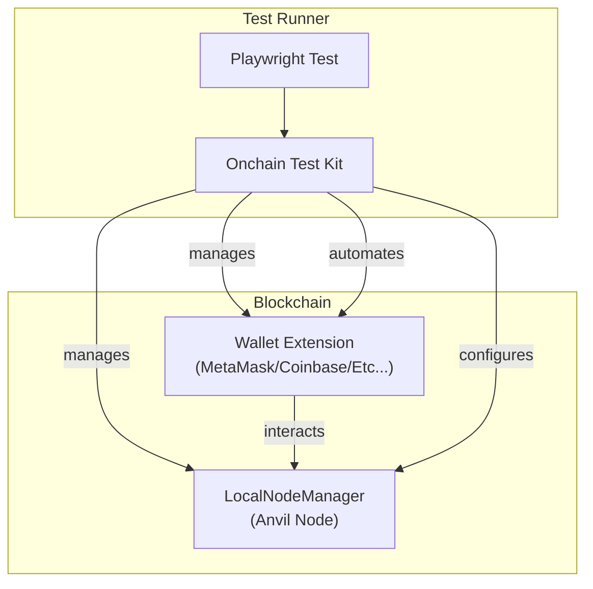
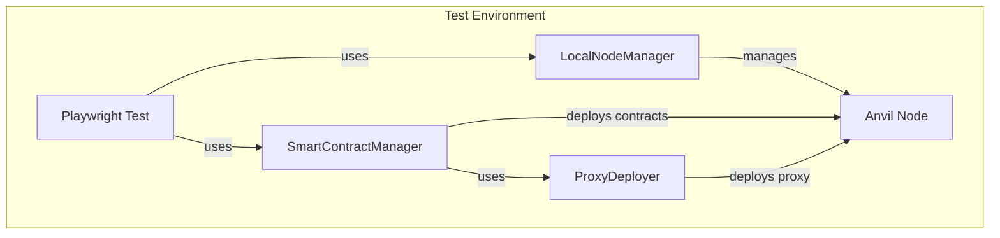

Building reliable onchain applications requires comprehensive testing. OnchainTestKit is a type-safe framework designed specifically for testing blockchain applications built with OnchainKit, providing seamless integration with Playwright for browser automation and wallet interactions.

## What is OnchainTestKit?

[OnchainTestKit](https://github.com/coinbase/onchaintestkit) is an end-to-end testing framework that automates:

- Wallet connections (MetaMask, Coinbase Wallet)
- Transaction flows and approvals
- Network switching
- Smart contract interactions
- Token swaps and minting
- Gas sponsorship testing

## Why Use OnchainTestKit?

Testing blockchain applications manually is time-consuming and error-prone. OnchainTestKit provides:

- **Type Safety**: Full TypeScript support with compile-time error checking
- **Wallet Automation**: Programmatic control over wallet interactions
- **Parallel Testing**: Run multiple tests simultaneously with isolated environments
- **Network Management**: Built-in support for local Anvil nodes and fork testing
- **OnchainKit Integration**: Designed to work seamlessly with OnchainKit components

## Want to learn more?

Check out [the full documentation](https://onchaintestkit.xyz/) for detailed guides on installation, configuration, and writing tests! 

## Architecture

<Frame>

</Frame>

<Frame>

</Frame>

## Key Features

<AccordionGroup>
<Accordion title="Playwright Integration">
  Automate browser-based wallet and dApp interactions with the power of Playwright's testing framework.
</Accordion>

<Accordion title="Multi-Wallet Support">
  Built-in support for MetaMask and Coinbase Wallet, with an extensible architecture for adding more wallets.
</Accordion>

<Accordion title="Smart Action Handling">
  Automate connect, transaction, signature, approval, and network switching flows with simple APIs.
</Accordion>

<Accordion title="Network Management">
  Use local Anvil nodes or remote RPC endpoints, with dynamic port allocation for parallel test execution.
</Accordion>

<Accordion title="Type Safety">
  Full TypeScript support for all configuration and test APIs, catching errors at compile time.
</Accordion>

<Accordion title="Fluent Configuration">
  Builder pattern for intuitive wallet and node setup, making configuration readable and maintainable.
</Accordion>
</AccordionGroup>

## Next Steps

- Install OnchainTestKit: `yarn add -D @coinbase/onchaintestkit`
- Check out the [OnchainTestKit repository](https://github.com/coinbase/onchaintestkit)
- See [example tests](https://github.com/coinbase/onchaintestkit/tree/master/example/frontend/e2e)
- Read the [Cookbook examples](/cookbook/testing-onchain-apps) for more test scenarios 
- Access the [full docs here](https://onchaintestkit.xyz/)